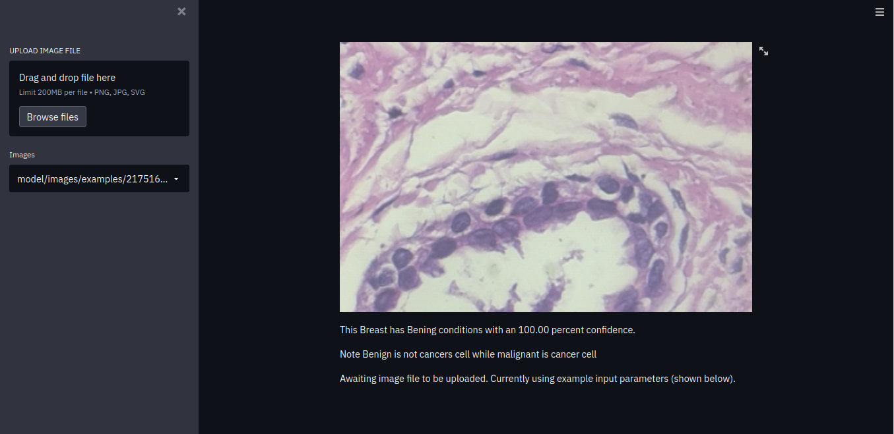

# web_prediction_model

<h1 style="center">Web based python simulation/prediction model using streamlit</h1>

 
WEBSITE:<a href="https://breastcancermodel.herokuapp.com/"><h1>https://breastcancermodel.herokuapp.com/<h1></a>

<h3>
Clone this repo
</h3>

        
<code style="">
git clone git@github.com:ianSurii/web_prediction_model.git
</code>
        

<h3>
Cd to this repo location and run>> in terminal
</h3>

        
<code>
streamlit run index.py
</code>
        

  

        

  
        
<h3>The <i style="color:green;">localhost </i>  url will open in browser </h3>
<code style="">

</code>

        

<h3>Drag and Drop breast cancer images or browse image files from your computer on the left hand sidemenu</h3>
The model will run and predict the condition of the image 

<code style="">
..loading
</code>
 <ul>
<li>Bening condition or</li> 
<li>Malignant condition</li> 
</ul>

